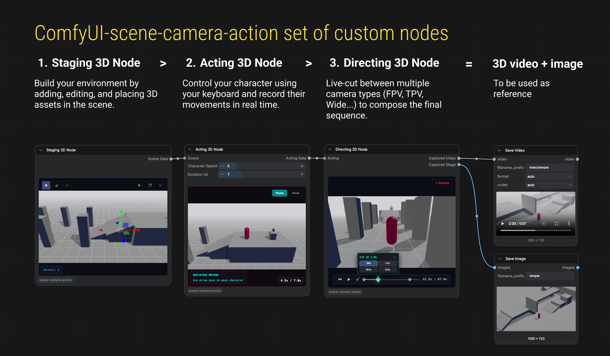
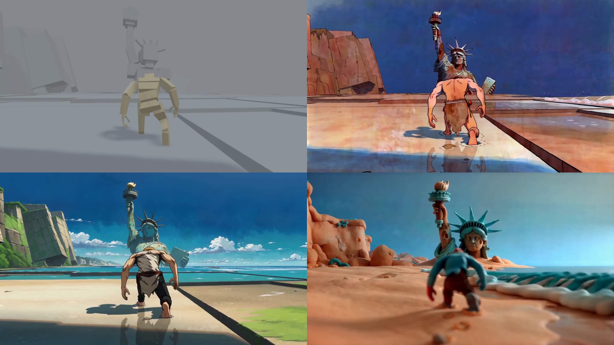
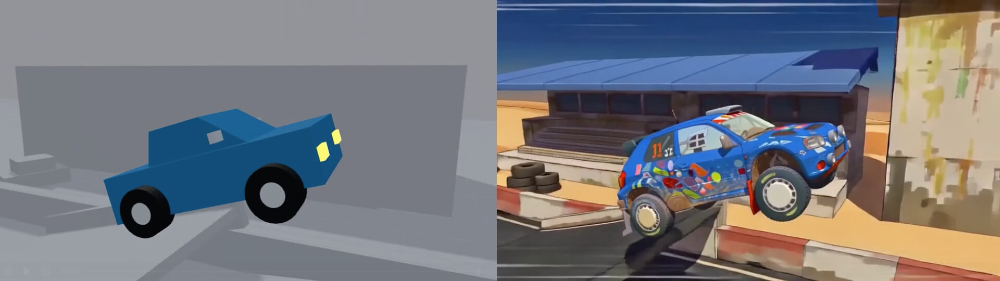

# ComfyUI-scene-camera-action

> [!NOTE]
> **ComfyUI-scene-camera-action (v0.4.0)** by [@arturitu](https://github.com/arturitu) / [Unboring.net](https://unboring.net).
> Configured for publishing on the official Comfy Registry (`comfyui-scene-camera-action`).

An interactive 3D scene staging, actor acting, and camera directing suite of custom nodes for **ComfyUI**.

Build your 3D environment, control and record actor movements in real time using your keyboard, and compose live camera cuts between multiple camera angles (TPV, FPV, Wide, Side) to generate high-fidelity reference video and stage imagery for video-to-video (such as HunyuanVideo, Wan2.1, or AnimateDiff) workflows.



---

## 🚀 Release History

### 📦 Current Version - v0.4.0 (Comfy Registry Prepared)
- **Official Registry Package Config**: Configured for `registry.comfy.org` under `comfyui-scene-camera-action`.
- **Clean Node Branding**: Listed under group/category **`scene-camera-action`**:
  - **`Staging`** (`StagingNode`)
  - **`Acting`** (`ActingNode`)
  - **`Directing`** (`DirectingNode`)
- **Staging Refactoring**: Clean architecture for Staging hierarchy, selection, and viewport rendering.

### 📦 v0.3.0
- **Animated 3D Humanoid Model**: Custom 3D human model with bone structure and armature animations.
- **Configurable Spawn Points**: UI selection for actor starting locations across Staging and Acting nodes.
- **3D Scene Presets**: Built-in previz tracks (`liberty_beach`, `industrial_ruin`, `warehouse`, `test-collider`).

[](https://www.linkedin.com/feed/update/urn:li:activity:7491165268455481345/)

### 📦 v0.2.0
- **Natural Language 3D Scene Builder (`SKILL.md`)**: Transform prompts or reference images into 3D stage compositions using any AI coding assistant.
- **Multi-Archetype Actor Physics Engine**: Support for Humanoid and Vehicle (`CarActor`) movement physics.
- **Hierarchical Scene Management**: Grouping (`Group`/`Ungroup`), multi-selection, and transform snapping.

[](https://www.linkedin.com/feed/update/urn:li:activity:7488962940134481920/)

---

## 🛠️ Workflow Nodes Breakdown (`scene-camera-action`)

### 1. Staging (`StagingNode`)
Build your 3D environment by placing, editing, grouping, duplicating, and transforming 3D assets:
- **Interactive 3D Viewport**: Orbit, pan, and zoom using standard MapControls.
- **Hierarchical Selection & Grouping**: Select multiple items with `Shift + Click`, group (`Group`) or ungroup (`Ungroup`) complex structures.
- **3D Transform Gizmos**: Move, rotate, and scale assets on all axes with optional `Shift` snapping.
- **Asset Duplication (`❐`)**: Instantly clone selected assets or groups.
- **Preset Loader**: Load built-in 3D scenes or custom JSON presets directly from the UI dropdown.
- **Output**: Sends `Stage Data` downstream to the Acting node.

### 2. Acting (`ActingNode`)
Control your actor in real time and record movement trajectories across the 3D stage:
- **Archetype Selection**: Switch between **Human** (capsule physics) and **Car** (vehicle physics).
- **Real-Time Keyboard Control**: Drive or walk the actor using `WASD` or `Arrow` keys.
- **Speed & Duration Control**: Adjust actor speed ($1.0 - 30.0$) and recording duration ($4.0\text{s} - 15.0\text{s}$).
- **Motion Recording**: Record actor locomotion trajectories and auto-play recorded loops.
- **Output**: Combines scene geometry, actor type, and motion trajectory into `Acting Data` for the Directing node.

### 3. Directing (`DirectingNode`)
Compose your sequence with live multi-camera cuts along a visual playback timeline:
- **Smart Multi-Camera Modes**: TPV (Third-Person), FPV (First-Person), Wide (Auto-Framing Master), and Side (Tracking).
- **Timeline Keyframing**: Add, move, and adjust camera cuts along the playback timeline.
- **Outputs**:
  - **`Captured Video` (`VIDEO`)**: 720p HD recorded video of the directed camera sequence.

---

## 🤖 Transform Prompts into 3D Scenes (`SKILL.md`)

Generate proportioned 3D previz scenes from natural language prompts or reference images using the included `scene-staging-builder` skill with any AI coding agent (**Antigravity**, **Claude Code**, **Codex**, **Cursor**, **Pi**, etc.).


The [`skills/scene-staging-builder/SKILL.md`](file:///Users/unboring/Documents/antigravity/ComfyUI-scene-camera-action/skills/scene-staging-builder/SKILL.md) instruction set equips AI coding assistants with 3D spatial reasoning to output clean 3D `SceneState` JSON preset files saved to `presets/`.

---

## 💻 Installation

### Via Comfy Registry (Recommended)
```bash
comfy node install comfyui-scene-camera-action
```

### Manual Installation
Clone this repository directly into your ComfyUI `custom_nodes` directory:

```bash
cd ComfyUI/custom_nodes
git clone https://github.com/arturitu/ComfyUI-scene-camera-action.git
cd ComfyUI-scene-camera-action
pip install -r requirements.txt
```

#### Windows Portable:
If you are using `ComfyUI_windows_portable`, run this from your portable root folder:
```bash
python_embeded\python.exe -m pip install -r ComfyUI\custom_nodes\ComfyUI-scene-camera-action\requirements.txt
```

Restart your ComfyUI server after installation.

---

## 📄 License

MIT License. Built by [@arturitu](https://github.com/arturitu) for creator workflows.
