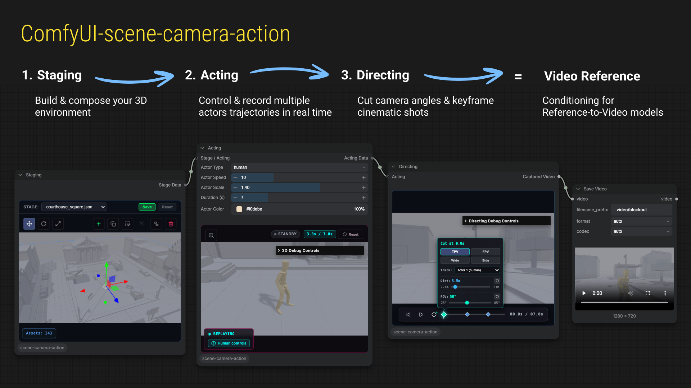
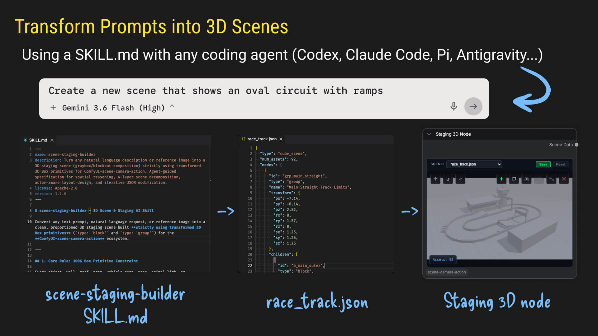

# ComfyUI-scene-camera-action

[](https://registry.comfy.org/)
[](https://github.com/Comfy-Org/ComfyUI-Manager)
[](https://github.com/arturitu/ComfyUI-scene-camera-action/releases)
[](LICENSE)

*Interactive 3D scene staging, actor acting, and camera directing suite for **ComfyUI**.*  
Created by [@arturitu](https://linkedin.com/in/arturoparacuellos) / [Unboring.net](https://unboring.net).

---

Stop prompting movement into a black box. **ComfyUI-scene-camera-action** turns AI video generation into an interactive, playable 3D previz studio:

1. **Staging:** Build navigable 3D blockout sets with instant colliders — manually or via AI prompts (`SKILL.md`).
2. **Acting:** Playable `WASD` controls & multi-track actor chaining with live ghost replays (no keyframing!).
3. **Directing:** Live camera cuts with anti-collision **Spring Arm**, outputting crisp 720p HD reference video (`VIDEO`) for models like **Seedance 2.5**, **MiniMax H3**, or **HunyuanVideo**.



---

## ⚡ Quick Installation

### Option 1: ComfyUI Manager (Recommended - 1-Click Install)
1. Open ComfyUI.
2. Open **Manager** ➔ **Custom Nodes Manager**.
3. Search for `Scene Camera Action` (or `comfyui-scene-camera-action`).
4. Click **Install**, then restart ComfyUI.

### Option 2: Comfy Registry CLI (`comfy-cli`)
```bash
comfy node install comfyui-scene-camera-action
```

### Option 3: Manual Git Clone
Open your terminal in your ComfyUI directory:

```bash
cd ComfyUI/custom_nodes
git clone https://github.com/arturitu/ComfyUI-scene-camera-action.git
pip install -r ComfyUI-scene-camera-action/requirements.txt
```

> **Windows Portable Users**: Run this from your `ComfyUI_windows_portable` root folder:
> ```bat
> python_embeded\python.exe -m pip install -r ComfyUI\custom_nodes\ComfyUI-scene-camera-action\requirements.txt
> ```

Restart ComfyUI after installation. The nodes will appear in the **scene-camera-action** category.

---

## 🎯 Ready-to-Use Example Workflows (Drag & Drop)

We provide pre-built workflows in the [`examples/`](examples/) folder so you can start directing immediately without any setup:

| Workflow | Description | Download |
| :--- | :--- | :--- |
| 🟢 **Basic 3D Previz** *(Recommended)* | **0 AI models required!** Pure 3D Previz pipeline (`Staging ➔ Acting ➔ Directing ➔ Save Video`) with `race_track.json` preset & Car actor ready to drive, including AI reference video integration. | [`basic_previz_workflow.json`](examples/basic_previz_workflow.json) |
| 👥 **Multi-Actor Chaining** | `industrial_ruin.json` preset with **Human** and **Quadruped** actors on distinct spawn points, synchronized ghost replays, and AI reference video integration. | [`multi_actor_workflow.json`](examples/multi_actor_workflow.json) |

### 💡 How to load a workflow:
- **Method A**: Download any `.json` from above and **drag & drop** it directly into your ComfyUI browser window.
- **Method B**: Click **Load** in ComfyUI and select the file from `ComfyUI/custom_nodes/ComfyUI-scene-camera-action/examples/`.

---

## 🎬 3-Step Creator Guide (No Programming Required)

https://github.com/user-attachments/assets/dd5c0d21-573a-467f-9d4b-1218e2c90cac

### 1. Staging (`StagingNode`) — *Build your 3D Environment*
- **Load Presets**: Pick built-in 3D environments from the preset dropdown (`courthouse_square`, `gas_station`, `liberty_beach`, `industrial_ruin`, `warehouse`, etc.).
- **Interactive Viewport**: Orbit (Left Click + Drag), Pan (Right Click + Drag), and Zoom (Scroll).
- **Transform & Compose**: Add primitives, move, rotate, and scale assets. Use `Shift + Click` for multi-selection and Grouping (`Group` / `Ungroup`).
- **Output**: Connects `Stage Data` downstream into the Acting node.

### 2. Acting (`ActingNode`) — *Drive & Record Performances*
- **3 Actor Archetypes**:
  - 🚶 **Human**: Rigged 3D character with automatic walking, running, and idle locomotion.
  - 🚗 **Car**: Vehicle physics with dynamic steering, acceleration, and drift.
  - 🐕 **Quadruped**: 4-legged animal archetype with full locomotion animations.
- **Game-Like WASD Controls**: Move around the stage in real time using `W`, `A`, `S`, `D`.
- **Practice Rehearsal Mode**: Test movement loops freely before recording.
- **Multi-Actor Chaining**: Connect multiple Acting nodes in series. Sequence independent actors while watching synchronized live ghost replays of previous takes!
- **Output**: Combines stage geometry and actor trajectories into `Acting Data`.

### 3. Directing (`DirectingNode`) — *Compose Camera Cuts & Capture HD Video*
- **Smart Camera Rigs**: Switch between Third-Person (TPV), First-Person (FPV), Tracking Side, and Auto-Framing Master Wide.
- **Anti-Collision Spring Arm**: Real-time obstacle avoidance prevents camera clipping against walls and geometry.
- **Visual Cut Timeline**: Add and edit camera cuts on the fly along the playback timeline.
- **Direct-to-Generative Output**: Outputs crisp 720p HD `Captured Video` (`VIDEO`) ready to plug into reference-to-video AI models!

---

## 🤖 Transform Prompts into 3D Scenes (`SKILL.md`)

Generate proportioned 3D previz scenes from natural language prompts or reference images using the included `stage-builder` skill with any AI coding agent (**Antigravity**, **Claude Code**, **Codex**, **Cursor**, **Pi**, etc.).



The [`skills/stage-builder/SKILL.md`](skills/stage-builder/SKILL.md) instruction set equips AI coding assistants with 3D spatial reasoning to output clean 3D `SceneState` JSON preset files saved to `presets/`.

---

## 💡 FAQ & Troubleshooting

<details>
<summary><b>Q: Directing node gives an error saying "Directing canvas is disabled. Connect an Acting node and record motion first."</b></summary>
<b>A:</b> Directing requires actor motion to frame the cameras. Make sure you select the Acting node, click <b>Record</b>, and move your actor using <code>WASD</code> before queuing the Directing node.
</details>

<details>
<summary><b>Q: Does this require a powerful GPU to run the 3D viewport?</b></summary>
<b>A:</b> No! The 3D viewport runs on standard WebGL in your browser and features <i>Demand-Based GPU Rendering</i>, meaning it automatically pauses rendering during graph navigation for lightweight performance.
</details>

<details>
<summary><b>Q: How do I feed the video into Seedance / MiniMax?</b></summary>
<b>A:</b> The Directing node outputs standard ComfyUI <code>VIDEO</code>. Simply connect the <b>Captured Video</b> wire into the video input of your chosen reference-to-video model (e.g., Seedance 2.5 / 2.0 Fast or MiniMax H3 Reference-to-Video).
</details>

---

## 🚀 Release History

### 🚀 Shipped - v0.5.0: Quadruped Actor (Current Version)
- **Rigged Quadruped Actor**: New 4-legged animal archetype (`QuadrupedActor`) with full locomotion animations (idle, walk, run, sit/crouch) built on `SkinnedActor`.
- **Configurable Actor Scaling**: Adjust actor sizes dynamically with automatic camera framing and speed scaling.
- **Practice Rehearsal Mode**: Loop actor movement in real time to test trajectories before recording.
- **Demand-Based GPU Rendering**: Pauses WebGL rendering during graph navigation for lightweight performance.
- **Stage Distance Fading & UI Upgrades**: Smooth edge fading, modern Lucide icons, and optimized node payloads.

https://github.com/user-attachments/assets/d8abce40-8af8-486d-b8ac-fbcf2a661968

### 📦 Shipped - v0.4.0: Multiple Actors
- **Multi-Actor Chaining**: Sequence and record multiple independent actors (humanoids and vehicles) on the same stage with synchronized playback.
- **Camera Spring Arm (Anti-Collision)**: Real-time obstacle avoidance prevents camera clipping against walls and geometry during dynamic camera moves.
- **Actor Color Customization**: Dynamic mesh coloring to visually distinguish different actors across the 3D viewport and node timeline.
- **Universal Stage Builder**: Universal 3D geometric engine with 5 core primitives and new presets (`courthouse_square`, `gas_station`).
- **Vue.js Architecture**: Modernized modular reactive UI components (`StagingWidget`, `ActingWidget`, `DirectingWidget`).

https://github.com/user-attachments/assets/2d03f9fe-42a2-4472-9543-373252dcf670

### 📦 Shipped - v0.3.0: Animated Humanoid
- **Animated 3D Humanoid Model**: Custom 3D human model with bone structure and armature animations.
- **Configurable Spawn Points**: UI selection for actor starting locations across Staging and Acting nodes.
- **3D Scene Presets**: Built-in previz tracks (`liberty_beach`, `industrial_ruin`, `warehouse`, `test-collider`).

https://github.com/user-attachments/assets/590b10b8-fe3f-4f4b-b1be-99f3fc646010

👉 [*See it in action on LinkedIn*](https://www.linkedin.com/feed/update/urn:li:activity:7491165268455481345/)

### 📦 Shipped - v0.2.0: Car Actor
- **Natural Language 3D Scene Builder (`SKILL.md`)**: Transform prompts or reference images into 3D stage compositions using any AI coding assistant.
- **Multi-Archetype Actor Physics Engine**: Support for Humanoid and Vehicle (`CarActor`) movement physics.
- **Hierarchical Scene Management**: Grouping (`Group`/`Ungroup`), multi-selection, and transform snapping.

https://github.com/user-attachments/assets/fc99bde7-7900-4fb1-9181-6c82dc451373

👉 [*See it in action on LinkedIn*](https://www.linkedin.com/feed/update/urn:li:activity:7488962940134481920/)

### 📦 Shipped - v0.1.0: Starting Point
- **Initial PoC Custom Nodes**: Proof-of-concept custom nodes (`Staging`, `Acting`, `Directing`).
- **Basic 3D Prev-viz**: Asset placement, single capsule actor control, and multi-camera timeline cuts.

https://github.com/user-attachments/assets/fde67050-c33d-406c-87e5-64b9d0544381

👉 [*See it in action on LinkedIn*](https://www.linkedin.com/feed/update/urn:li:activity:7486069273581400064/)

---

## 📄 License

MIT License. Built with ❤️ by [@arturitu](https://github.com/arturitu) / [Unboring.net](https://unboring.net).

